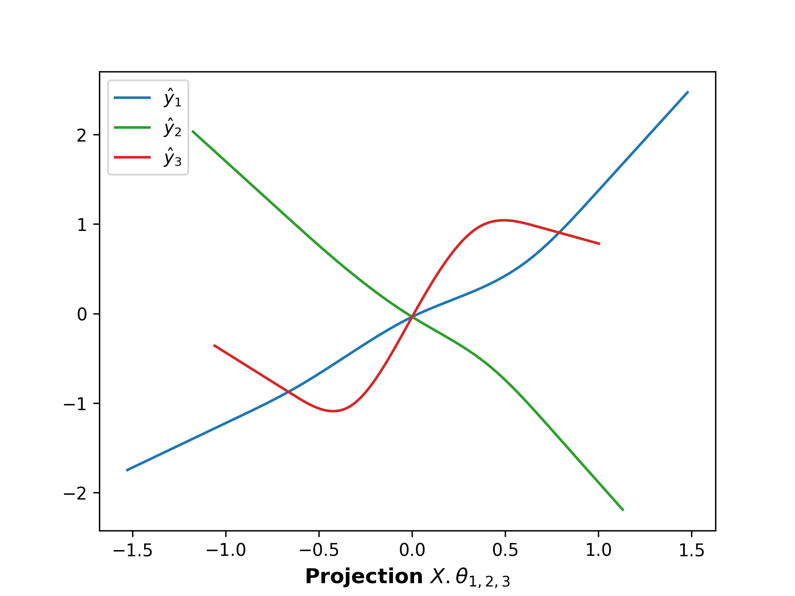
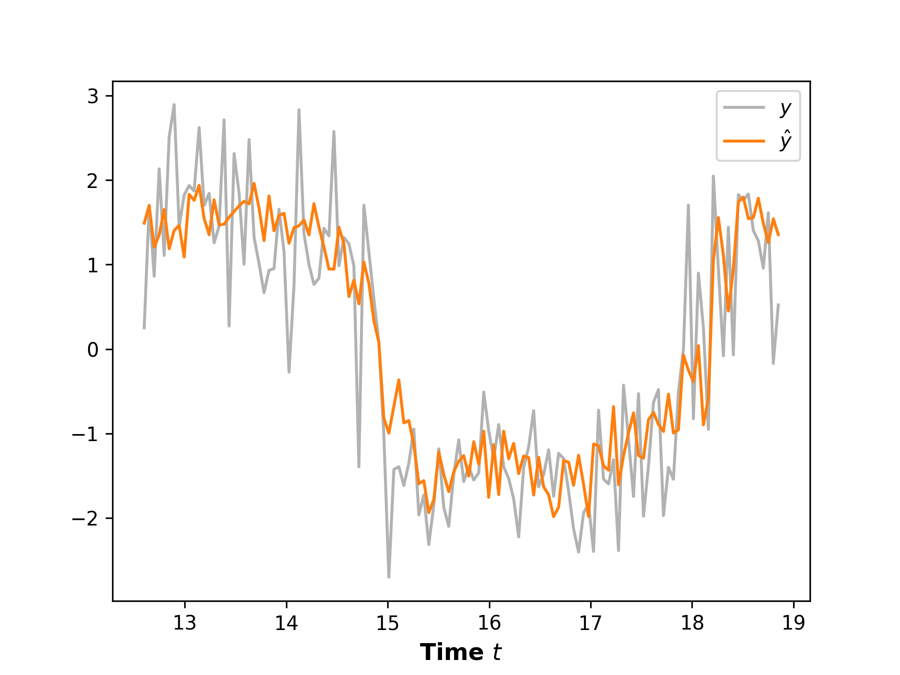
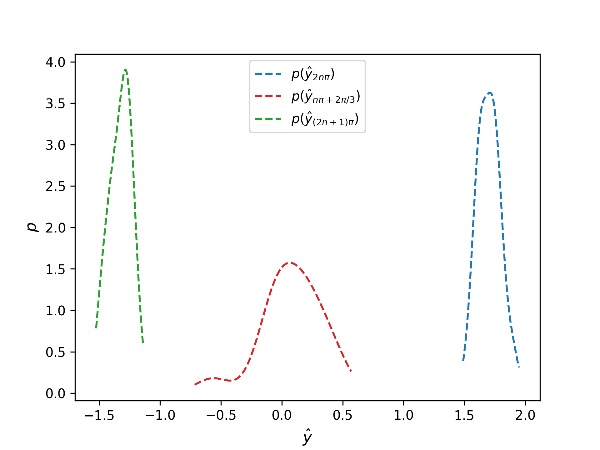

# BPPR - Hypothetical Order Execution Problem

"Your pipes are good but your algos are bunk." You hear this repeatedly from clients who are all putting more business Orgman's way, or Itic's, when they need shares bought or sold. At Arcblays bank you're desperate to catch up and your team has figured out what to do. There's a glimmer of hope for increasing market share but management has a funny five and rationalizes it away. Your team is gone, algo performance sputters, Millenium barely even sends any pity business and the lads at Balyasny don't invite you for beers and backslapping anymore. 

So you take on a thorny problem to try and claw your way back: lit venue vs dark pool allocation. When a client places an order you can slice and dice it, routing to any venue you think will cost the least. Sometimes it's the highly liquid but transparent exchanges, sometimes it's the murky but lower cost dark pools. You don't dare propose a full-blown stochastic control solution to management, so you sweat over the analytics and contruct a retrospective optimal allocation split that you can calculate for any hypothetical order, using exchange and TRF feed information. But retrospective is no good in real time: you need to be able to predict what the optimal allocation should be, based on relevant inputs. Here's a stylization based on three input signals, demonstrating the almost bang-bang control-like nature of the allocation that needs predicting:

$X_{1}=\sin(t)+\varepsilon, X_{2}=\cos(t)+\varepsilon, X_{3}=\tanh(X_{1}+X_{2})+\varepsilon$

$y=\alpha_{1}X_{1}+\alpha_{2}X_{2}+\alpha_{3}\mathrm{sgn}(X_{3})e^{-X_{3}^{2}}+\epsilon$

Giving BPPR several hundred MCMC iterations yields three ridge functions with projections
$\theta_{1}=[-0.95,0.33,0]$, $\theta_{2}=[-0.98,-0.18,0]$, $\theta_{3}=[0.12,0,0.99]$
and plotting the trace for each projection reveals the response pattern each ridge function is targeting (up to the modulation that the sigmoidization effects):

Predicting each response for a few hundred new data samples shows the response relationship well captured:

and plotting kdes to visualize the posterior distribution at different times, we observe the expected higher variance at 'switching' times when the response rapidly changes sign:

As the projection coefficients make clear, the random initialization and mcmc trajectory can influence the structure of the solution. A true projection `[0.707, -0.707, 0]` might be emulated with the *combination* `[0.866, -0.5, 0]` and `[-0.159, -0.207, 0]` which BPPR may struggle to reconcile as a single projection owing to large SSEs for the proposed deletion or a prohibitive anti-similarity measure for modifying either ridge function. The online update is a strongly mitigating dynamic however: introducing a new source of randomness into the SSE encourages proposal acceptances in a similar manner to a higher annealing temperature. You see this first hand by updating the BPPR with the new data used above just for prediction, after which the number of chosen ridge functions has dropped to two, with projections:
$\theta_{1}=[0.87,0.5,0]$, $\theta_{2}=[0.12,0,0.99]$.

The results look promising but performance enhancement may be a fireable offence, so you don't let on to management. Nevertheless, you're back to beers with Balyasny. 

The data generation for this model problem can be examined more closely in [TestData.py](../tst/TestData.py)
